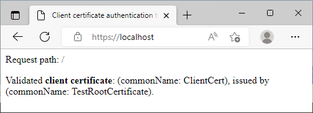

Examples of how to use certificates for client authentication in web and TLS socket scenarios. The examples are geared towards Windows with trusted certificate storage, but all principles also apply to other operating systems.


## Getting started instructions

Prerequisites:
* Windows computer
* [Visual Studio](https://visualstudio.microsoft.com/) - for buiding the C++ and C# sample projects
* [Git](https://git-scm.com/) for Windows - for OpenSSL that's required for the Python projects
* [Python](https://www.python.org/) - to run the test web server

### Generate certificates for testing (optional)
Test certificates are already added to the `TestCertificates` folder. These can be re-generated by running `powershell .\GenerateCertificates.ps1` from the TestCertificates subfolder. Please note that this script will leave certificate "residue" in the "Current User\Personal" certificate store.


### Install root certificate (optional)
This step will remove the "Not secure" warning when testing from a web browser.


Install the root certificate:
* Either: From an admin command prompt: `certutil –addstore –f "root" TestRootCertificate.cer`
* Or: Double-click on `TestRootCertificate.cer`, select "Install Certificate", select "Local Machine" as store location, then "Trusted Root Certificate Authorities" as certificate store.

The root certificate will now show up in the Windows "Manage computer certificates" window:

 


### Install client certificate
This step will enable the web browser to use the client certificate for authentication against the server.

Install the client certificate:
* Either: From a command prompt: `certutil -user –importpfx ClientCert.pfx NoRoot,NoExport` (password "1234")
* Or: Double-click on `ClientCert.pfx`, select "Install Certificate", select "Current User" as store location, enable "Protect private key... (Non-exportable)", then install with default settings.
* Or: From the web browser "Manage certificates" menu: Import `ClientCert.pfx` into "Personal" certificate store with default settings.

The client certificate will now show up in the Windows "Manage user certificates" window:

 

It will also show up in the web browser certificate dialogs:

 


### TPM storage of private key
Installed certificates will by default have their private key managed by the SW-based "Microsoft Software Key Storage Provider" when importing non-exportable. It's also possible to store the private key in the TPM chip for enhanced HW-enforced security.

This should in principle by possible with `certutil -user -csp TPM -p "" -importpfx ClientCert.pfx NoExport`. However, that doesn't seem to work as expected, and instead leads to a `NTE_INVALID_PARAMETER` error. This appears to be a known issue, and one can use the [TPMImport](https://github.com/glueckkanja-pki/TPMImport) tool as work-around. The certificate can then be imported to the TPM with `TPMImport.exe -user -v ClientCert.pfx ""`.

One can verify the actual key storage with `certutil -user -store My ClientCert`. You'll then get `Provider = Microsoft Platform Crypto Provider` if the private key is actually stored in the TPM.


## Client authentication
The `clientAuth` OID (1.3.6.1.5.5.7.3.2) EKU field in the client certificate enables it to be used for client authentication.
Double-click on `WebServer.py` to start the test web server to be used for testing of client authentication.

### Testing from web browser
Steps:
* Open https://localhost:443/ in a web browser.
* Select `ClientCert` in the certificate selection menu.


* Observe that the selected certificate is listed in the generated webpage.



### Testing from code

| Language | Secure certificate store support                          | Sample code               |
|----------|----------------------------------------------------------|---------------------------|
| C++      | [CNG](https://learn.microsoft.com/en-us/windows/win32/seccng/cng-portal) or [CertificateStores](https://learn.microsoft.com/en-us/uwp/api/windows.security.cryptography.certificates.certificatestores) | See [WebClientCpp](WebClientCpp/) (both using UWP and MSXML APIs) |
| C#/.Net  | [X509Store](https://learn.microsoft.com/en-us/dotnet/api/system.security.cryptography.x509certificates.x509store) | See [WebClientNet](WebClientNet/) |
| Java     | [Leveraging Security in the Native Platform Using Java ..](https://www.oracle.com/technical-resources/articles/javase/security.html) | Not yet tested |
| Python   |No known support (see [#10](../../issues/10)) | See [WebClientPy](WebClientPy/) (uses file-based certificate handling)|
| Go       |No known support (see [#17](../../issues/17)) | See [WebClientGo](WebClientGo/) (uses file-based certificate handling)|

All the language samples are command-line applications that tries to authenticate against `https://localhost:443/` using the client certificate. The applications can be run without any arguments and will output the following on success:
```
Client certificate: ClientCert

<html><head><title>Client certificate authentication test</title></head><body><p>Request path: /</p><p>Validated <b>client certificate</b>: (commonName: ClientCert), issued by (commonName: TestRootCertificate).</p></body></html>
```

## Code signing
The `codeSigning` OID (1.3.6.1.5.5.7.3.3) EKU field in the client certificate enables it to be used for code signing.

How to sign a binary:
* From a developer command prompt, run `signtool sign /a <FileName>.exe`
